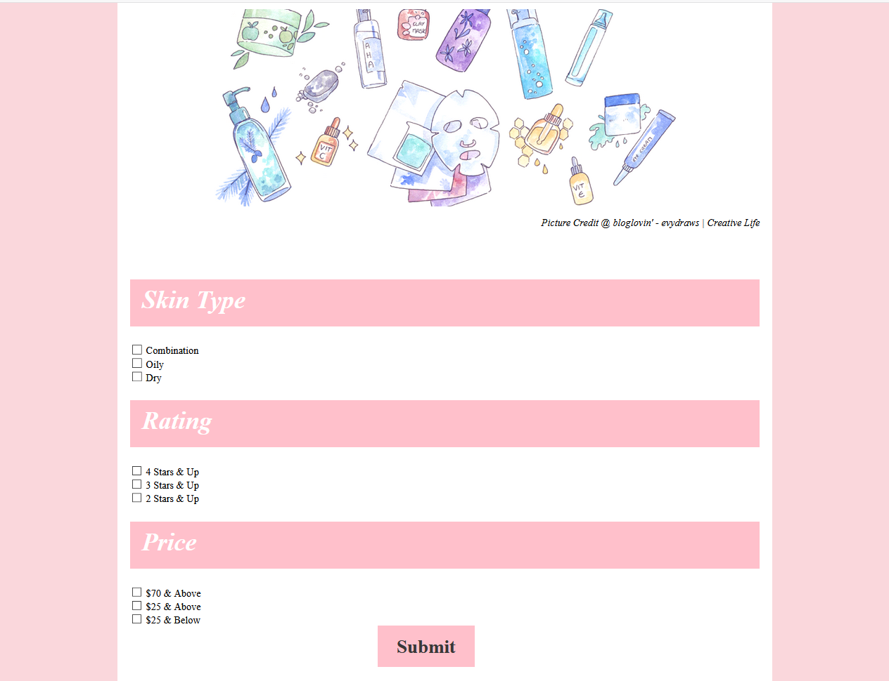

# Introduction
I've been wanting to apply my programming skills and build a tool that would be practical for people.  The project I decided on was developing a tool that would help the user to find the best skin care product based on the user's skin type.  This project was inspired by a close friends of mine who was completely new to skin care.  She asked me about my skin care routine.  At that moment, I thought to myself why not make a tool that would help users choosing the best product?  

Skin-Care is a very exciting project for me because I am passionate about skin care.  Now I can combine two things I am passionate about and find a solution that would help myself and others! 

There will be a few different phases for this project.  

# Phase 1
Webscraped different sites using beautiful-soup package from Python to create a database.  Then I would host it on the AWS-RDS instance.

# Phase 2
Analyzed the data using SQL and graph that using Matplotlib

# Phase 3
Created the front-end of the web app

# Phase 4
Create the back-end of the web app - I am planning on using Flask-Python

This project will allow me to have an idea of each aspect of software engineering.  I will be able to learn and apply new tools.